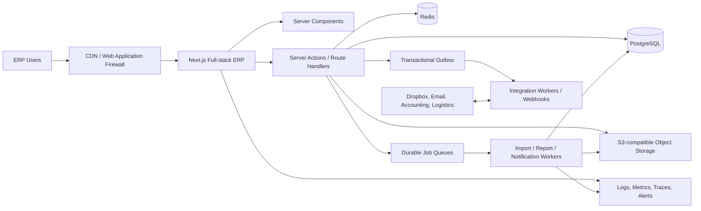
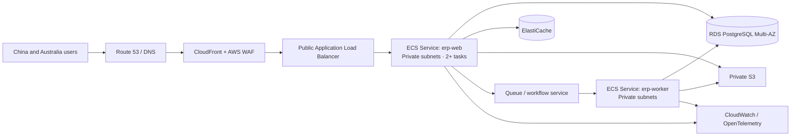
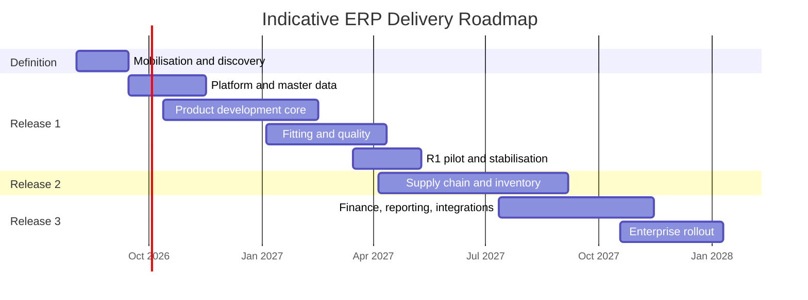

# ERP Technical Implementation Plan

> Document status: Draft for stakeholder review  
> Version: 1.6
> Date: 4 August 2026
> Recommended delivery model: phased implementation with a modular-monolith architecture  
> Technology direction: full-stack Next.js, PostgreSQL, Redis, S3-compatible object storage, and independent workers
> Execution tracker: [`ERP-IMPLEMENTATION-CHECKLIST.en.md`](./ERP-IMPLEMENTATION-CHECKLIST.en.md)

## 1. Executive Summary

This document defines a practical implementation plan for a new garment production ERP platform. The target system covers fifteen top-level business modules and preserves a seven-stage product-development chain:

1. Master Data
2. Merchandise Planning
3. Style Design
4. Material Development
5. Design Sampling
6. Fitting
7. Quality Control

The wider platform also includes bulk production, procurement, material/WIP/finished-goods inventory, finance, reporting, partner profiles, dashboard functions, and system administration.

The recommended approach is not to build every observed screen at once. Delivery should be organised into three business releases:

- **Release 1 — Product Development MVP:** master data, planning, style/Tech Pack, materials/BOM, sampling, fitting, and QC.
- **Release 2 — Supply Chain Execution:** bulk production, procurement, inventory, traceability, and partner performance.
- **Release 3 — Financial Control and Intelligence:** settlement, AR/AP integration, costing, reporting, dashboards, and advanced integrations.

With a stable product team of approximately 12–16 people, the Product Development MVP is expected to take **6–8 months**, while the full baseline platform is expected to take **12–15 months**, including pilot deployment and stabilisation. These estimates must be re-baselined after discovery, data profiling, and scope sign-off.

### 1.1 How Progress Is Tracked

The implementation plan defines scope, architecture, sequence, controls and acceptance criteria. The companion [ERP Implementation Checklist](./ERP-IMPLEMENTATION-CHECKLIST.en.md) is the operational source for step-level progress. Every checklist item has a stable ID and must be supported by evidence before it is marked complete. Phase exit and release gates remain unchecked until all mandatory evidence is reviewed and accepted; percentage complete alone cannot override a failed gate.

## 2. Purpose and Success Criteria

### 2.1 Objectives

The implementation will:

- Establish one governed digital record for each style and its complete lifecycle.
- Connect planning, Tech Pack, BOM, sampling, fitting, QC, production, inventory, and financial outcomes.
- Replace fragmented spreadsheets, chat messages, and duplicated records with controlled workflows.
- Preserve source files, document versions, approvals, evidence, and audit history.
- Support Chinese and English across navigation, forms, notifications, exports, and reference data.
- Provide a scalable foundation without premature microservice complexity.
- Allow phased adoption so business value is delivered before the entire ERP is complete.

### 2.2 Measurable Outcomes

The programme should agree baseline values during discovery and target the following outcomes:

| Outcome | Initial target |
| --- | --- |
| Product-development records linked by `styleId` | 100% |
| Published Tech Packs with explicit version | 100% |
| Sample and fitting decisions recorded in the system | ≥ 95% |
| QC failures with owner, evidence, and corrective action | 100% |
| Inventory-affecting transactions represented in a ledger | 100% |
| Critical actions included in immutable audit history | 100% |
| Ordinary list-page response time | P95 under 1.5 seconds |
| Ordinary synchronous command response | P95 under 1 second |
| Production availability target | 99.9% during agreed service hours |
| Pilot-user task completion without assistance | ≥ 90% |

### 2.3 Initial Non-goals

Unless separately approved, the first release will not include:

- A fully general-purpose accounting general ledger.
- Payroll, HR, CRM, e-commerce, or point-of-sale functions.
- Native mobile applications; responsive web and installable PWA behaviour are sufficient initially.
- Microservices for every business domain.
- Unreviewed AI decisions that directly create or approve production records.
- Exact visual or implementation copying of the reference ERP.

## 3. Scope Baseline

The current discovery evidence includes automated menu/page captures, screenshots, API observations, recordings, a workflow diagram, and an interactive prototype. The observed navigation contains fifteen major modules with deeper second-, third-, and fourth-level functions. The source evidence is a requirements aid, not the final specification.

| Domain | Release | Priority capability |
| --- | --- | --- |
| Dashboard | R1, expanded in R3 | Role-based tasks, warnings, approvals, and operational metrics |
| Master Data | R1 | Customers, suppliers, factories, sizes, warehouses, terms, templates, numbering |
| Merchandise Planning | R1 | Per customer decision (5 Aug 2026), scope reduced to Material Swatch only; seasons, collections, briefs, plans, line plans, calendars and target cost are out of scope for this phase |
| Style Design | R1 | Style record, Tech Pack, SKU matrix, measurement, operation, labels |
| Material Development | R1 | Fabric/trim master, swatches, colours, quotes, tests, sourcing, BOM |
| Partner Profiles | R2 | Customer, supplier, and factory profiles and scorecards |
| Design Sampling | R1 | Sample orders, rounds, due dates, costs, follow-up, evidence |
| Fitting | R1 | Fit rounds, measurements, comments, decisions, actions |
| Quality Control | R1/R2 | PP checks in R1; incoming, inline, and final inspections in R2 |
| Bulk Production | R2 | Orders, capacity, production sheets, WIP, packing, actual costs |
| Material Procurement | R2 | Requisition, PO, approval, receipt, return, supplier performance |
| Material Inventory | R2 | Lot/dye-lot stock, receipt, issue, transfer, count, reservation |
| WIP Inventory | R2 | WIP lots, operation movements, traceability |
| Finished Goods Inventory | R2 | SKU stock, QC hold, allocation, receipt, shipment, return/rework |
| Finance | R3 | Invoices, receipts, payments, reconciliation, settlement, costing |
| Reporting Centre | R3 | Governed KPIs, dashboards, scheduled and asynchronous exports |
| System Administration | R1 | Tenant, organisation, user, role, data scope, audit, workflow, settings |

### 3.1 Scope-control Method

Every requested feature must be classified as:

- **Must:** required to complete the agreed release business flow, meet compliance needs, or protect data integrity.
- **Should:** important, but a documented workaround exists for the first launch.
- **Could:** valuable enhancement that may be scheduled when capacity permits.
- **Not now:** explicitly excluded from the current release.

No screen enters development solely because it exists in the reference system. It must have a named business owner, user outcome, process position, data owner, acceptance criteria, and release priority.

## 4. Delivery Principles

1. **Design around business flows, not menus.** Menus organise access; end-to-end processes deliver value.
2. **Use `styleId` as the lifecycle spine.** Transaction documents retain their own IDs and reference the relevant style, version, SKU, lot, order, or partner.
3. **Build a modular monolith first.** Enforce domain boundaries in code and data ownership; extract services only when operational evidence justifies it.
4. **Publish immutable business versions.** Tech Packs, BOMs, measurement specifications, approvals, and final QC records must be reproducible.
5. **Treat auditability as a product feature.** Actors, decisions, source evidence, status changes, and before/after values must be queryable.
6. **Make background work visible.** Imports, reports, media processing, and recalculation jobs require progress, retry, and failure diagnostics.
7. **Use configuration for controlled variation.** Statuses, numbering, tolerances, approval routes, and templates should be configurable within safe boundaries.
8. **Release behind measurable gates.** A phase is complete only when its exit criteria are met.

## 5. Target Technical Architecture



### 5.1 Recommended Technology Stack

| Layer | Recommendation | Notes |
| --- | --- | --- |
| Application | Next.js App Router, React, TypeScript | Full-stack modular monolith: Server Components for reads, Server Actions for internal commands, Route Handlers for integrations/public APIs |
| UI | Ant Design or shadcn/ui + Radix | Select one primary component strategy during Phase 0 |
| Client data/table | TanStack Query + TanStack Table | Client-side dynamic queries where needed; standard ERP table abstraction on TanStack Table |
| Forms | React Hook Form + Zod | Shared validation contracts where practical |
| Validation/contracts | Zod plus explicit application DTOs | Validate all trust boundaries; publish OpenAPI only for external or multi-client APIs |
| ORM | Prisma | Prisma Schema, Client and Migrate; use transactions and parameterised TypedSQL/raw SQL for justified complex queries |
| Primary data | PostgreSQL | Transactions, constraints, JSONB where justified, optional RLS |
| Cache/jobs | Redis + BullMQ | Keep durable business-visible job status in PostgreSQL; never hold long-running work inside an HTTP request |
| Files | S3-compatible object storage | Private objects, presigned access, retention and scanning |
| Authentication | Credentials + short-lived JWT + revocable server-side session | Initial delivery; Argon2id passwords, `jose`, HttpOnly cookies and an adapter boundary for later OIDC/SSO |
| Observability | OpenTelemetry + managed logs/metrics/errors | One Trace ID across web, API, workers, and integrations |
| Infrastructure | Containers and infrastructure as code | Separate development, staging, UAT, and production |

### 5.2 Full-stack Domain Modules

The Next.js application should be organised into independently owned domain modules. Framework route folders must remain thin; domain rules belong in server-only application and domain layers:

```text
iam
tenant-org
master-data
planning
style-tech-pack
material
sampling-fitting
quality
sales-production
procurement
inventory
finance
workflow
reporting
files-import
notification-integration
audit
```

Modules may not directly modify another module's tables. Cross-domain work must use an application service, stable interface, or domain event. Database changes and outbox events must be committed in the same transaction.

Use Server Actions for authenticated commands initiated by the ERP user interface. Use Route Handlers for webhooks, file callbacks, external integrations, SSE endpoints, and APIs consumed by clients outside the Next.js application. Every entry point must authenticate, authorise, validate input, enforce tenant/data scope, and record relevant audit evidence. Inventory, finance, approval, and publication commands require database transactions, idempotency, and optimistic or pessimistic concurrency controls as appropriate.

Long-running AI imports, spreadsheet processing, document generation, media conversion, scheduled reports, bulk notifications, recalculations, and full third-party synchronisations must be submitted to a durable queue. Independent workers may share server-only domain packages but must not import UI or request-context code.

#### 5.2.1 Initial Authentication Baseline

The first delivery will use application-managed credentials and JWT-based access rather than an external OIDC provider. JWT is a token format, not the complete authorisation model. The implementation must use short-lived access tokens in `HttpOnly`, `Secure` production cookies together with a revocable server-side session/refresh record in PostgreSQL; Redis may accelerate session checks but is not the only durable source.

- Hash passwords with Argon2id and enforce password/reset/rate-limit policy.
- Sign and verify tokens using `jose`; maintain key identifiers and a documented rotation procedure.
- Keep JWT claims minimal: subject, tenant, session ID, authentication version, token ID and timestamps. Do not embed the complete permission matrix.
- Resolve current roles, data scopes, account status and sensitive permissions on the server. A disabled user, password reset, role change or forced logout must invalidate relevant sessions.
- Protect refresh-token material by storing only a hash server-side and rotating it on use; detect replay and revoke the session family.
- Apply CSRF/origin protection appropriate to cookie-based mutations, plus login and refresh rate limits.
- Re-authorise every Server Action and Route Handler. UI visibility never substitutes for server permission checks.
- Hide the implementation behind an `AuthService`/session interface so a later OIDC provider can replace credential verification without rewriting domain authorisation.

OIDC/enterprise SSO, federation and provider-specific MFA are deferred until the business selects a provider or requires central identity. CI/CD OIDC federation to AWS is a separate machine-identity control and remains recommended for the later deployment phase.

### 5.3 Suggested Repository Structure

```text
erp-platform/
  apps/
    erp/                 # Next.js full-stack ERP application
    worker/              # Independent TypeScript job and integration workers
  packages/
    ui/                  # Shared UI components and tokens
    domain/              # Server-only domain rules and application services
    contracts/           # Zod schemas and external API contracts
    database/            # Schema, migrations, transactions, outbox
    config/              # Shared lint, TypeScript, and build config
    testing/             # Fixtures, factories, and test utilities
  infrastructure/        # Infrastructure as code and environment config
  docs/
    architecture/        # ADRs, context and container diagrams
    product/             # Process maps and acceptance specifications
    operations/          # Runbooks, recovery, and support procedures
```

### 5.4 Architecture Decision and Evolution Triggers

The programme has selected full-stack Next.js instead of a mandatory separate NestJS API for the initial platform. This decision reduces duplicate transport models, generated-client maintenance, cross-service latency, and deployment overhead while the product and domain boundaries are still evolving. It does not permit business logic to accumulate in React components, route files, or ad-hoc Server Actions: those entry points must delegate to tested server-only application services.

An independent service should be proposed through an ADR only when at least one measurable trigger exists:

- A public or multi-client API requires an independently versioned lifecycle.
- A workload needs materially different scaling, runtime, availability, or security isolation.
- A domain has an autonomous team and a stable, enforceable ownership boundary.
- Release coupling or resource contention is causing repeated production impact.
- A third-party integration requires network placement or credentials that should not exist in the web runtime.

The default response to long execution time is a durable worker, not a new synchronous API service. The default response to code complexity is stronger module boundaries and tests, not a network boundary.

### 5.5 Docker-based Local Development Environment

Local development must be reproducible on macOS and Windows without requiring engineers to install PostgreSQL or Redis directly. Docker Compose should provide infrastructure dependencies, while the Next.js application may run either on the host for the fastest hot reload or inside a development container for environment parity.

#### 5.5.1 Required Local Services

| Service | Purpose | Local exposure | Persistent data |
| --- | --- | --- | --- |
| `postgres` | Primary transactional database | `localhost:5432` | Named Docker volume |
| `redis` | Queue, cache, distributed locks, idempotency | `localhost:6379` | Optional named volume; required if local job recovery is tested |
| `object-storage` | S3-compatible file development using MinIO or LocalStack | Console and S3 API ports | Named Docker volume |
| `mail` | Local email capture using Mailpit or equivalent | Web inbox and SMTP ports | Not required |
| `erp` | Next.js full-stack application | `localhost:3000` | Stateless |
| `worker` | Import, report, media, notification and integration jobs | No public port | Stateless |
| `migration` | One-shot schema migration and optional seed job | None | Must exit successfully before application startup |

The Compose file must define health checks for PostgreSQL, Redis, and object storage. Use `depends_on` with `condition: service_healthy` for runtime dependencies and `condition: service_completed_successfully` for the migration job so container start order does not get confused with actual service readiness. Docker documents this readiness pattern in its [Compose startup-order guidance](https://docs.docker.com/compose/how-tos/startup-order/).

#### 5.5.2 Required Development Files

```text
erp-platform/
  apps/
    erp/
      Dockerfile             # Multi-stage production image
      Dockerfile.dev         # Optional development target
    worker/
      Dockerfile
  docker/
    postgres/init/           # Local-only bootstrap scripts
    minio/                   # Bucket bootstrap policy
  compose.yaml
  compose.override.yaml      # Optional developer overrides, no secrets
  .env.example               # Safe variable names and sample values
  .dockerignore
  Makefile or taskfile.yml   # Stable developer commands
```

The production Next.js image should use a multi-stage build and Next.js `output: "standalone"`. It must run as a non-root user, expose one application port, include only runtime files, and define a lightweight health endpoint such as `/health/live`. Do not bake credentials, `.env` files, uploads, generated reports, or build caches into the image.

#### 5.5.3 Local Environment Procedure

1. Install Docker Desktop or another Compose-compatible Docker runtime.
2. Copy `.env.example` to `.env.local`; use development-only credentials and never production values.
3. Run `docker compose config` to validate interpolation and merged configuration.
4. Start infrastructure with `docker compose up -d postgres redis object-storage mail`.
5. Wait for health checks, then run the one-shot migration and seed profile.
6. Start `erp` and `worker`, or run Next.js on the host against the containerised dependencies.
7. Verify login, file upload, one queued worker job, one database transaction, email capture, and `/health/ready`.
8. Use `docker compose logs -f erp worker` for combined diagnostics.
9. Use `docker compose down` to stop services while preserving volumes. Use `docker compose down -v` only when an engineer explicitly intends to erase local data.

Recommended stable commands:

```bash
docker compose up -d
docker compose ps
docker compose logs -f erp worker
docker compose run --rm migration
docker compose exec erp npm test
docker compose down
```

#### 5.5.4 Local Data and Security Rules

- Keep a minimal deterministic seed containing organisations, roles, one style lifecycle, sample/Fitting data, QC, inventory movements, and representative finance records.
- Provide a separate synthetic volume or fixture set for performance testing; never distribute production exports to developer laptops by default.
- Pin container image major/minor versions. Renovate or Dependabot should propose controlled updates.
- Use platform-aware images or multi-architecture builds so Apple Silicon and CI runners behave consistently.
- Add resource limits where useful to reveal memory assumptions early, but do not make developer machines mimic production capacity exactly.
- Treat the local object store as disposable; business records must reference object keys rather than host filesystem paths.
- Test graceful shutdown locally: stop the worker during a job and confirm retry/idempotency behaviour.

### 5.6 Deployment Target: Amazon ECS on AWS Fargate

The eventual production target should use two independently scalable ECS/Fargate services: `erp-web` for Next.js and `erp-worker` for asynchronous jobs. Both use immutable images from Amazon ECR. PostgreSQL runs on Amazon RDS/Aurora PostgreSQL, Redis-compatible services run on ElastiCache, and business files use private S3 buckets. ECS tasks must remain stateless and replaceable. This section defines the target and later deployment procedure; AWS resources are intentionally deferred until core local business flows and integration tests are stable.



#### 5.6.1 AWS Foundation and Environment Separation

1. Use infrastructure as code—AWS CDK, Terraform, or CloudFormation—for all persistent resources and ECS definitions.
2. Use separate AWS accounts for production and non-production where practical; at minimum, isolate VPCs, databases, buckets, secrets, keys, log groups, and IAM roles.
3. Select the primary region through measured China/Australia latency, legal, operational and data-residency review. Sydney is the natural initial candidate for Hello Molly operations, but representative mainland-China users must complete real-network testing before commitment.
4. Create a VPC across at least two Availability Zones. Place only the ALB in public subnets; ECS tasks, RDS and ElastiCache belong in private subnets.
5. Decide whether private tasks reach AWS services through NAT gateways or VPC endpoints. Budget for NAT data-processing costs; consider endpoints for ECR, S3, CloudWatch Logs, Secrets Manager and other heavily used AWS services.
6. Restrict security groups by service relationship: internet to ALB on 443; ALB to `erp-web` on the container port; application/worker tasks to RDS and Redis on their service ports. Do not expose database or Redis publicly.

Fargate always uses `awsvpc` task networking, which assigns each task an ENI and enables task-level security groups. Review the official [Fargate task-definition constraints](https://docs.aws.amazon.com/AmazonECS/latest/developerguide/fargate-tasks-services.html) and [ECS network-security guidance](https://docs.aws.amazon.com/AmazonECS/latest/developerguide/security-network.html) before finalising the task definition.

#### 5.6.2 Build and Image Supply Chain

1. Build separate `erp-web` and `erp-worker` images from a pinned Node.js base image.
2. Run lint, type checks, unit tests, integration tests, software-composition analysis, secret scanning and container vulnerability scanning before publishing.
3. Build once and promote the same image digest through test, staging and production; do not rebuild per environment.
4. Tag images with the immutable Git commit SHA and optionally a release tag. Deploy by digest where supported.
5. Store images in private ECR repositories with encryption, lifecycle retention, enhanced scanning where required, and cross-region replication only when justified.
6. Produce an SBOM and sign images for release integrity; retain provenance with the deployment record.
7. Give CI/CD short-lived AWS access through OIDC federation instead of stored long-lived AWS access keys.

#### 5.6.3 Task Definitions and IAM

- Maintain separate task definitions for Web, Worker and one-shot Migration tasks. They may reuse the same application image with different commands only if this does not unnecessarily enlarge or privilege the Worker image.
- Set explicit CPU, memory, ephemeral storage, port mapping, read-only root filesystem where compatible, stop timeout, health check, log driver and deployment environment variables.
- Separate the **Task Execution Role** from the **Task Role**. The execution role permits ECS to pull ECR images, retrieve referenced secrets and write logs; the task role grants the application only the S3, queue, KMS or other runtime calls it needs. AWS documents this distinction in its [ECS IAM-role guidance](https://docs.aws.amazon.com/AmazonECS/latest/developerguide/security-iam-roles.html).
- Store database credentials, authentication secrets and integration credentials in AWS Secrets Manager or SSM Parameter Store, encrypted with KMS. Never place secret values in task-definition environment variables, source control or image layers.
- Plan secret rotation. Because injected ECS secrets are resolved when a task starts, rotate the secret and force a controlled new deployment.
- Use the `awslogs` driver initially, with structured JSON logs, retention, tenant-safe identifiers and Trace IDs. Never log passwords, tokens, bank details or full uploaded document content.

#### 5.6.4 Database and Schema Migration

Database migration is a controlled release step, not an application-container startup side effect:

1. Back up and confirm recovery readiness before a high-risk migration.
2. Run the migration tool as a one-off ECS task using the exact release image and a dedicated least-privilege role.
3. Wait for successful completion before updating ECS services.
4. Use expand-and-contract migrations so the old and new application versions can overlap during rolling deployment.
5. Separate destructive cleanup into a later release after compatibility and rollback windows close.
6. Test migrations using production-like volume and data shape; record duration and lock behaviour.
7. Avoid a migration from every Web/Worker replica, which creates races and unpredictable startup failures.

#### 5.6.5 Service Deployment Procedure

1. Provision or update infrastructure through reviewed infrastructure-as-code changes.
2. Publish the tested image digest to ECR.
3. Run the one-off database migration task and archive its logs/result.
4. Register new Web and Worker task-definition revisions referencing the image digest and immutable configuration versions.
5. Deploy `erp-web` behind the ALB with at least two production tasks across Availability Zones.
6. Deploy `erp-worker` separately with concurrency tuned to database, queue and third-party limits.
7. Enable the ECS rolling-deployment circuit breaker with automatic rollback. ECS can mark a deployment failed based on task launch or health-check failures and return to the last completed deployment; see the official [deployment circuit-breaker behaviour](https://docs.aws.amazon.com/AmazonECS/latest/developerguide/deployment-circuit-breaker.html).
8. Execute post-deployment smoke tests: authentication, authorised read/write, file upload, queued job, audit record, notification, database connection and critical business transaction.
9. Observe errors, latency, saturation, queue age, database connections and business smoke metrics through the stabilisation window.
10. Promote the release record only after ECS reaches steady state and the verification gate passes.

#### 5.6.6 Health, Scaling and Resilience

- Implement `/health/live` as a lightweight process check and `/health/ready` as a bounded readiness check. Do not make every ALB probe execute expensive database or third-party calls.
- Define container health checks in the ECS task definition; ECS only evaluates checks included in the task definition for task health. See [ECS container health checks](https://docs.aws.amazon.com/AmazonECS/latest/developerguide/healthcheck.html).
- Configure ALB health checks, health-check grace period, deregistration delay and application shutdown consistently. The Next.js process must handle `SIGTERM`, stop accepting new work and finish or safely abandon requests within the ECS stop timeout.
- Workers must stop polling on shutdown, extend/renew job leases while running, and make job handlers idempotent so interrupted tasks can retry safely.
- Scale Web tasks on a combination of CPU/memory and ALB request/latency metrics. Scale Workers primarily on queue depth, oldest-job age and processing time—not Web traffic.
- Set minimum, maximum and desired task counts explicitly. Production Web should normally run at least two replicas; avoid making a single task an availability dependency.
- Protect RDS from scale-out connection storms by setting per-task pool limits and evaluating RDS Proxy where connection behaviour warrants it.
- Use RDS Multi-AZ, automated backups, point-in-time recovery, tested restore procedures and deletion protection. Redis is not the transactional source of truth.
- Keep generated files and user uploads in S3, never Fargate ephemeral storage. Increase Fargate ephemeral storage only for bounded temporary processing and monitor usage.

#### 5.6.7 CDN, Caching and Multi-instance Next.js

- Serve immutable Next.js assets through CloudFront with versioned cache keys. Keep authenticated ERP HTML and business API responses private/no-store unless a specific safe caching policy exists.
- Configure CloudFront and the reverse proxy so cookies, locale, tenant and authorisation headers are handled correctly; prevent one tenant's response from entering a shared cache key.
- Do not rely on in-process memory for sessions, job state, rate limits, locks or shared application state.
- If Next.js revalidation/ISR is used across multiple tasks, configure a shared durable cache and cache-tag coordination, or avoid ISR for authenticated ERP routes. The [Next.js self-hosting guide](https://nextjs.org/docs/app/guides/self-hosting) describes multi-instance cache and deployment coordination requirements.
- Set a consistent `NEXT_SERVER_ACTIONS_ENCRYPTION_KEY` across instances and deployments when required by the selected Next.js version and deployment pattern; rotate it through a planned compatibility window.

#### 5.6.8 Security, Observability and Cost Controls

- Terminate public TLS using ACM on CloudFront/ALB; redirect HTTP to HTTPS; use AWS WAF managed rules, rate limits and tested upload-size limits.
- Use least-privilege IAM, KMS encryption, S3 Block Public Access, database encryption, security-group referencing, CloudTrail, GuardDuty and centralised security findings as required by the security baseline.
- Create CloudWatch alarms for ECS running-task deficit, deployment failure, 5xx, latency, CPU/memory, task restarts, queue age/dead letters, RDS storage/connections/replication, Redis memory/evictions and failed scheduled jobs.
- Send ECS deployment-failure events to EventBridge and the operational alerting channel.
- Add synthetic checks for login and one safe critical workflow; include a release/build identifier in health and diagnostics endpoints.
- Configure log retention and S3 lifecycle policies rather than retaining all operational data indefinitely.
- Tag resources by application, environment, owner, cost centre and data classification. Create AWS Budgets and anomaly alerts before production launch.
- Review Fargate task size using measured CPU/memory percentiles. Separate Web and Worker scaling prevents report generation or AI import from forcing unnecessary Web capacity.

#### 5.6.9 China and Australia Connectivity Considerations

- Validate from representative office networks in mainland China and Australia using the actual authentication, DNS, CDN, file-upload and WebSocket/SSE paths; consumer VPN tests are not an adequate substitute.
- Avoid critical frontend resources loaded from third-party public CDNs or font services that may be slow or inaccessible. Package fonts and core assets with the application.
- Keep the initial transactional database in one region. Do not create active-active multi-region writes for core ERP transactions without a proven business requirement and conflict model.
- If mainland-China performance is inadequate, evaluate an approved acceleration or China-region architecture separately. AWS China regions use separate accounts, credentials, domains and regulatory arrangements; they are not a transparent extension of the global AWS account.
- Document degraded-mode expectations for external services such as email, SMS, Dropbox and accounting integrations so temporary cross-border failures do not corrupt ERP transactions.

#### 5.6.10 Rollback and Disaster-Recovery Procedure

- Application rollback: redeploy the previous known-good task-definition revision and image digest. The deployment circuit breaker should perform this automatically for failed rolling deployments.
- Database rollback: prefer forward fixes. Use expand-and-contract migrations so application rollback does not require destructive schema rollback.
- Worker rollback: stop or scale down the faulty Worker service, preserve queued jobs, deploy the previous handler and replay only idempotent jobs.
- Configuration rollback: version task definitions, secret references, feature flags and infrastructure changes together with the release record.
- Disaster recovery: restore RDS to a tested point, validate S3 object/version integrity, restore queue/workflow state as designed, deploy the recorded image digests, then run reconciliation before reopening writes.
- Exercise backup restoration, regional dependency failure and queue replay at least annually, with more frequent tests for high-impact financial and inventory paths.

## 6. Data Architecture and Governance

### 6.1 Identity Model

- `styleId` connects the full product lifecycle.
- `techPackVersionId`, `bomVersionId`, and `measurementVersionId` identify immutable published specifications.
- `styleColorId`, `styleSizeId`, and `skuId` identify sellable variants.
- `sampleOrderId`, `productionOrderId`, `purchaseOrderId`, and other document IDs identify transactions.
- `materialLotId`, `wipLotId`, and `finishedGoodsLotId` provide traceability.
- `tenantId` and organisation/data-scope fields protect multi-tenant and departmental access.

### 6.2 Core Data Rules

- Use UUIDv7 or another sortable globally unique identifier for internal primary keys.
- Keep human-readable document numbers separate from primary keys.
- Store monetary values as fixed-precision numeric values with currency.
- Store quantities with unit and controlled precision.
- Store timestamps in UTC and render them in the user's configured timezone.
- Use optimistic concurrency on edited aggregates.
- Do not hard-delete posted transactions or published specifications.
- Maintain an immutable inventory movement ledger and rebuildable balance projections.
- Maintain a business settlement layer separately from any double-entry general-ledger integration.
- Record field-level provenance for imported data where source evidence matters.

### 6.3 Data Ownership

Each entity must have one system-of-record module. For example, the Style module owns style identity; Inventory owns movements and balances; Finance consumes approved operational events but does not rewrite operational records. A cross-domain data ownership matrix must be approved before Phase 1 development.

### 6.4 AI-assisted Import

Excel, Dropbox, and document import must use a controlled draft workflow:

```text
Upload / webhook
→ security scan and content hash
→ original-file retention
→ asynchronous parsing
→ canonical field mapping
→ confidence and validation issues
→ human review
→ draft record
→ explicit approval and publish
```

The import pipeline requires idempotency, parser versioning, source coordinates, retry, rollback, and a complete decision log. AI output must never silently post inventory, finance, approval, or production transactions.

### 6.5 Chinese and English Internationalisation

Chinese and English are first-class production requirements, not a presentation-only enhancement. The language switch must cover the entire authenticated system: navigation, headings, forms, table columns, actions, validation, errors, confirmations, workflow tasks, notifications, search, help, imports, exports, generated PDFs and operational emails.

The implementation must distinguish three concerns:

1. **Application text:** version-controlled translation keys for UI labels, validation, errors and system messages.
2. **Controlled reference data:** stable language-neutral codes with approved Chinese and English display values, effective dates and audit history.
3. **User-entered business content:** preserve the original text and language; add explicit translated fields or translation records only where the business requires bilingual publication. Never silently machine-translate legal, financial, technical or quality evidence.

Required design rules:

- Use locale identifiers such as `zh-CN` and `en-AU`; do not use a boolean `isChinese` flag.
- Store a tenant default and user language preference, while allowing an explicit session switch that persists across login and devices.
- Keep enum/status values and business logic language-neutral. Store `APPROVED`, for example, and translate it at the presentation boundary rather than storing “已批准” as the state.
- Define and test a fallback chain. Missing translations must be observable and must not render raw keys or blank actions in production.
- Do not concatenate translated fragments into sentences. Use parameterised ICU-style messages with pluralisation and grammatical context.
- Format date, time, number, currency and unit values using the selected locale and the user's timezone, while storing timestamps in UTC and monetary currency explicitly.
- Preserve exact business identifiers, style codes, document numbers, SKUs, Pantone references and source evidence across languages.
- Make search support Chinese and English names, aliases and identifiers without duplicating the system-of-record entity.
- Generate bilingual-capable Excel and PDF outputs with embedded Chinese fonts, controlled column labels, correct pagination and no character substitution.
- Version and approve bilingual notification/email templates; record which locale and template version produced each outbound message.
- Keep audit records canonical and immutable. The viewer may localise event labels, but actor input, before/after data and evidence must not change when the display language changes.
- Enforce translation-key extraction/validation in CI, including missing, unused and placeholder-mismatch checks. Add pseudo-localisation or an equivalent expansion test to reveal clipped layouts.
- Test every critical workflow once in `zh-CN` and once in `en-AU`, including role changes, validation errors, approvals, file generation and notifications.

The initial production locale, tenant fallback order, responsibility for business translations and approval workflow for terminology must be signed off during Phase 0. Translation content is owned jointly by Product/Business Analysis and UX; Engineering owns framework implementation and automated completeness controls.

## 7. Detailed Delivery Roadmap

The durations below are planning ranges. Workstreams overlap after the architecture and domain foundations are stable.

### Phase 0 — Mobilisation and Discovery (Weeks 1–6)

**Objectives**

- Convert captured evidence and recordings into an agreed scope and process baseline.
- Define product ownership, governance, architecture decisions, and delivery controls.
- Validate the highest-risk technical and data assumptions.

**Activities**

- Conduct workshops for the seven-stage product flow and downstream supply-chain/finance flows.
- Create current-state and target-state BPMN or equivalent process maps.
- Build a screen/function catalogue linked to evidence, actors, data, and business outcomes.
- Identify country, currency, tax, localisation, retention, and audit obligations.
- Profile representative spreadsheets and legacy exports.
- Define the canonical domain glossary and initial ER model.
- Run short technical spikes for authentication, table performance, file upload, import parsing, and bilingual UI.
- Validate the production multi-stage Docker image, local Compose dependency stack, Apple Silicon/CI compatibility, and graceful Worker shutdown.
- Record ECS/Fargate target constraints and confirm that local container design remains compatible; defer AWS resource provisioning until the deployment-readiness stage.
- Confirm the UI system, document the selected Prisma/TanStack Table/BullMQ baseline, define the initial JWT/session design, and select the hosting and observability approach.
- Produce the release backlog, dependency map, estimate, RAID log, and decision log.

**Deliverables**

- Signed product vision and release scope.
- Prioritised capability map and process maps.
- Initial domain model and data ownership matrix.
- Architecture Decision Records (ADRs).
- Approved local-container blueprint, deferred ECS deployment blueprint and initial infrastructure cost range.
- Non-functional requirement baseline.
- Delivery estimate and staffing plan.
- Prototype usability findings and migration assessment.

**Exit criteria**

- Business owners approve Release 1 process boundaries and acceptance outcomes.
- No unresolved architecture issue prevents foundation implementation.
- The local Docker environment demonstrates one Web process, one Worker, one queued job, one database migration and safe Worker interruption/retry without requiring AWS resources.
- At least three representative legacy datasets have been profiled.
- Product, engineering, data, security, and operations owners are named.

### Phase 1 — Platform Foundation and Master Data (Weeks 5–14)

**Objectives**

- Establish a production-grade engineering platform.
- Deliver identity, permissions, audit, files, workflow primitives, and governed master data.

**Activities**

- Create the monorepo, health-checked Docker Compose development environment, multi-stage production images, environments, CI/CD, infrastructure as code, and secrets management.
- Implement credential login, short-lived JWT access, revocable sessions, tenant/organisation hierarchy, users, roles, and data scopes; retain an adapter boundary for later OIDC.
- Implement audit events, document numbering, localisation, feature flags, and notification foundations.
- Build reusable page shell, navigation, table, search, form, attachment, timeline, and approval components.
- Deliver customer, supplier, factory, season, size, unit, warehouse, terms, and template masters.
- Implement external API/OpenAPI contracts where required, error conventions, idempotency, concurrency controls, and outbox processing.
- Maintain deployment portability: stateless Web/Worker containers, externalised configuration, stdout logs, health endpoints, graceful shutdown and one-shot migrations. Defer actual ECS infrastructure provisioning.
- Establish telemetry, dashboards, alerts, backup, restore, and vulnerability scanning.

**Exit criteria**

- A user can sign in, switch language, and access only permitted tenant/organisation data.
- Master records pass agreed duplicate, reference, status, and audit rules.
- CI blocks failed tests, lint, type checks, security checks, and invalid migrations.
- A new engineer can start the complete local dependency stack and seed data from documented commands; local Web and Worker health checks pass.
- The production-style image runs locally, executes migration once, passes health checks and completes the critical Docker-based smoke workflow.
- Backup restoration succeeds in a non-production environment.
- Shared UI components meet keyboard and responsive-layout acceptance checks.

### Phase 2 — Product Development Core (Weeks 11–28)

**Objectives**

- Deliver the connected planning, style, Tech Pack, material, BOM, and sampling workflow.

**Activities**

- Implement Merchandise Planning's Material Swatch capability. Per customer decision (5 Aug 2026), season/collection planning, briefs, line plans, milestones, owners, and target cost are out of scope for this phase.
- Implement style identity, colour/size/SKU matrix, media, labels, operations, and lifecycle state.
- Implement versioned Tech Packs, measurements, tolerances, construction details, and publish controls.
- Implement fabric, trim, packaging, supplier source, swatch, test, MOQ, and quote records.
- Implement versioned BOM and approved substitutions.
- Implement sample request/order, rounds, follow-up, cost, due date, attachments, and exceptions.
- Implement Excel/Dropbox-assisted import as reviewable drafts.
- Add role-based dashboard tasks and overdue/exception queues.

**Exit criteria**

- A pilot style can move from a merchandise brief to a published Tech Pack and sample request.
- All lifecycle records are discoverable from `styleId`.
- Published versions are immutable and historical versions remain reproducible.
- Importing the same source twice does not create duplicate business records.
- Permission, audit, API contract, and end-to-end tests cover critical paths.

### Phase 3 — Fitting, PP and Quality Control (Weeks 23–36)

**Objectives**

- Close the product-development loop with evidence-based fitting and quality gates.

**Activities**

- Build fitting templates, sessions, body-area comments, actual-versus-spec measurement, images, and action ownership.
- Support first fit, second fit, size-set/SMS, and PP sample rounds.
- Implement decisions: Approve, Approve with Comments, Revise and Resubmit, and Reject.
- Build QC templates, check categories, defects, severity, evidence, corrective action, and reinspection.
- Implement PP approval and configurable release-blocking rules.
- Add lifecycle timeline, decision history, alerts, and SLA reporting.

**Exit criteria**

- The pilot team completes the entire seven-stage flow without off-system decision tracking.
- Failed required checks block release according to configuration.
- Every fit/QC decision has actor, time, evidence, version, and reason.
- Pilot UAT passes the agreed business scenarios and permission matrix.

### Release 1 Pilot and Stabilisation (Weeks 33–40)

**Activities**

- Migrate pilot master and active product-development records.
- Train champions and pilot users using role-based scripts.
- Run controlled production use for selected seasons, brands, or teams.
- Operate daily triage, defect prioritisation, adoption measurement, and reconciliation.
- Complete penetration testing, recovery rehearsal, operational readiness, and go-live approval.

**Release 1 gate**

- No open Severity 1 defects; agreed disposition for Severity 2 defects.
- Business owners sign off critical end-to-end scenarios.
- Migration reconciliation meets agreed thresholds.
- Support coverage, escalation, rollback, and continuity procedures are tested.

### Phase 4 — Supply Chain, Production and Inventory (Weeks 37–58)

**Objectives**

- Connect approved product specifications to procurement, production, stock, and fulfilment.

**Activities**

- Implement bulk order, production order, capacity, production sheet, contract, packing, and actual-cost capture.
- Generate material requirements from approved BOM/version and order demand.
- Implement purchase requisition, purchase order, approval, receipt, return, and variance.
- Implement material lot/dye-lot, reservation, issue, transfer, adjustment, and cycle count.
- Implement WIP lots, operation movements, subcontract hand-off, and traceability.
- Implement finished-goods receipt, QC hold, allocation, shipment, return, and rework.
- Build supplier/factory profiles and delivery, quality, price, and response scorecards.
- Add barcode/label integration where approved.

**Exit criteria**

- A production order traces to the approved style and specification version.
- Required material demand reconciles with reservations, purchasing, receipt, and issue.
- Inventory ledger balances reconcile to physical/count test scenarios.
- Lot-level forward and backward traceability passes agreed tests.
- Concurrent stock transactions pass integrity and load tests.

### Phase 5 — Finance, Reporting and Integrations (Weeks 51–68)

**Objectives**

- Provide operational settlement, financial control, costing, and management insight.

**Activities**

- Implement invoice, receipt, payment, advance, allocation, reconciliation, and approval workflows.
- Connect purchasing, receiving, production, inventory, and settlement events.
- Define integration boundaries with the chosen accounting/general-ledger platform.
- Implement standard operational and financial reports with governed definitions.
- Implement asynchronous exports, scheduled reports, and row/data-scope filtering.
- Add executive, production, procurement, inventory, quality, and finance dashboards.
- Complete agreed email, Dropbox, accounting, logistics, and identity integrations.

**Exit criteria**

- Financial documents reconcile to their source operational transactions.
- Segregation-of-duties rules protect payment and adjustment actions.
- Report totals reconcile to signed reference queries/datasets.
- Integration failure, retry, dead-letter, and replay scenarios are demonstrated.
- Month-end rehearsal completes within the agreed operating window.

### Phase 6 — Enterprise Rollout and Optimisation (Weeks 65–76)

**Objectives**

- Roll out across remaining teams and establish sustainable product operations.

**Activities**

- Establish the AWS staging environment only after core business flows and local integration tests are stable.
- Provision ECR, VPC/subnets, ALB, ECS Web/Worker/Migration tasks, RDS, ElastiCache, S3, IAM, Secrets Manager, CloudWatch and deployment rollback controls through infrastructure as code.
- Deploy the immutable release image to AWS staging, run one-off migrations, complete China/Australia connectivity, performance, security, recovery and UAT verification.
- Establish the production AWS environment, rehearse cutover/rollback, and release only after the staging and operational-readiness Gates pass.
- Migrate remaining in-scope data by rollout wave.
- Expand training, champions, support coverage, and knowledge-base content.
- Tune performance based on production traces and real workload.
- Review permissions, retention, audit, cost, availability, and capacity.
- Retire duplicate spreadsheets or legacy functions only after reconciliation and approval.
- Convert remaining observations into a prioritised post-launch roadmap.

**Exit criteria**

- AWS staging and production are provisioned from reviewed infrastructure as code and use the same tested immutable image digests.
- ECS health, scaling, monitoring, migration-once, circuit-breaker rollback and disaster-recovery evidence is accepted.
- Adoption, data quality, performance, reliability, and support KPIs meet agreed thresholds.
- Operational ownership has transferred from programme delivery to product/support teams.
- Legacy retirement and data-retention decisions are approved and evidenced.

## 8. Indicative Timeline



The dates illustrate sequencing from an assumed August 2026 start. Contracting, staffing, holidays, data quality, scope changes, and integration dependencies may change the baseline. The programme should manage forecasts using completed-team velocity and milestone evidence, not fixed dates alone.

## 9. Workstreams and Ownership

| Workstream | Accountable owner | Main responsibilities |
| --- | --- | --- |
| Product and process | Product Director | Scope, outcomes, priority, process ownership, acceptance |
| Architecture | Solution Architect / Tech Lead | Boundaries, standards, ADRs, technical risk, NFRs |
| Full-stack application | Application Lead | Next.js architecture, domain modules, Server Actions, Route Handlers, design system, accessibility, performance |
| Domain and workers | Backend/Platform Lead | Transactions, database ownership, jobs, integrations, concurrency and reliability patterns |
| Data and migration | Data Lead | Canonical model, quality, mapping, migration, reconciliation |
| UX and research | Product Designer | Workflows, prototypes, usability tests, bilingual experience |
| Quality engineering | QA Lead | Test strategy, automation, release evidence, defect governance |
| Platform and security | DevOps/Security Lead | CI/CD, infrastructure, identity, observability, resilience, security |
| Change and rollout | Change Lead | Communications, training, champions, adoption, support transition |

### 9.1 Recommended Core Team

| Role | Indicative allocation |
| --- | ---: |
| Product Director / Product Manager | 1–2 |
| Business Analysts / Domain Specialists | 2 |
| Solution Architect / Engineering Lead | 1 |
| Full-stack Next.js Engineers | 5–7 |
| Platform / Worker Engineers | 2–3 |
| Product Designer | 1 |
| QA / Automation Engineers | 2 |
| Data / Integration Engineer | 1–2 |
| DevOps / Platform Engineer | 1 |
| Security specialist | 0.25–0.5 shared |
| Change, training, and support lead | 1 from pilot preparation onward |

At least one empowered business owner must be available for each active domain. Engineering capacity without timely business decisions will not shorten delivery.

## 10. Delivery Governance and Cadence

### 10.1 Operating Rhythm

- Two-week development iterations.
- Weekly product/engineering dependency review.
- Fortnightly working-software demonstration to business owners.
- Monthly architecture, security, data, and programme risk review.
- Formal release-readiness review before every pilot or production deployment.
- Quarterly scope and benefits review after the first production release.

### 10.2 Backlog Hierarchy

```text
Business outcome
  → End-to-end process
    → Capability
      → Epic
        → User story / enabler
          → Acceptance scenario and automated tests
```

Every implementation story should identify:

- Business actor and desired outcome.
- Process preconditions and resulting state.
- Domain owner and affected entities.
- Permission and data-scope rules.
- Validation, audit, notification, and failure behaviour.
- Chinese and English text requirements.
- API/schema changes and migration impact.
- Acceptance examples and test level.
- Telemetry required to operate the feature.

### 10.3 Decision Governance

Architecture, data, security, and process decisions with long-term impact must be recorded as ADRs or decision records. Each record includes context, options, decision, owner, date, consequences, and review trigger. Unresolved decisions receive a deadline and escalation owner.

## 11. Environment and DevOps Plan

### 11.1 Environments

- **Local:** containerised dependencies and synthetic/approved test data.
- **Development:** integration environment for each merge or shared branch policy.
- **Test:** stable automated integration and regression environment.
- **UAT:** controlled business acceptance with production-like configuration.
- **Production:** protected, monitored, backed up, and accessible through approved deployment pipelines only.

Production data must not be copied to lower environments without approved masking and minimisation.

### 11.2 CI/CD Controls

Every pull request should run:

- Formatting, linting, type checking, and dependency checks.
- Unit, module integration, and API contract tests.
- Database migration validation against a representative schema.
- Software composition, secret, and static security scans.
- Build and selected Playwright smoke tests.

Production deployment should use immutable artifacts, automated migration checks, health verification, progressive exposure where possible, and documented rollback/roll-forward procedures. Database changes must follow expand-and-contract patterns when backward compatibility is required.

## 12. Quality Engineering Strategy

| Test level | Purpose | Typical owner |
| --- | --- | --- |
| Unit | Domain calculations, validators, state transitions | Engineers |
| Module integration | Repository, database, queue, transaction, and permission behaviour | Engineers + QA |
| API contract | OpenAPI compatibility and consumer expectations | Engineers |
| Component | Tables, forms, editors, localisation, accessibility | Frontend + QA |
| End-to-end | Critical user journeys across web/API/data | QA |
| Migration/reconciliation | Mapping, counts, totals, references, repeatability | Data + QA + business |
| Performance | Concurrency, large tables, reports, queues, inventory contention | QA + platform |
| Security | Access control, tenant isolation, abuse cases, penetration test | Security + QA |
| Resilience | Retry, timeout, worker restart, restore, integration outage | Platform + engineers |
| UAT | Business fitness and operational readiness | Business owners |

### 12.1 Critical Automated Journeys

At minimum, automate:

1. Create a plan and style, publish a Tech Pack, and issue a sample request.
2. Record fitting results, revise the specification, and retain history.
3. Fail and re-pass a QC gate with corrective action evidence.
4. Release a production order from an explicit approved version.
5. Calculate requirements, procure materials, receive lots, and issue to production.
6. Receive finished goods, apply QC hold/release, allocate, and ship.
7. Create and approve settlement documents from source transactions.
8. Verify role, organisation, warehouse, and tenant isolation.

### 12.2 Definition of Done

A capability is done only when:

- Acceptance scenarios pass and business behaviour is demonstrated.
- Permissions, audit, error, concurrency, localisation, and accessibility are addressed.
- Automated tests exist at the appropriate levels.
- API and user documentation are updated.
- Metrics, logs, traces, and alerts support production diagnosis.
- Data migration/configuration implications are resolved.
- Security and privacy checks pass.
- No unresolved critical defect remains.

## 13. Security, Privacy and Audit Plan

- Apply tenant isolation to every business query and command.
- Use RBAC plus data scope for organisation, department, brand, warehouse, self, and assignment constraints.
- Require stronger controls or step-up verification for payments, stock adjustments, approvals, and permission changes.
- Record immutable audit events for authentication, configuration, approvals, posting, deletion/voiding, export, and privileged access.
- Protect private files with short-lived signed URLs, malware scanning, size/type restrictions, and retention policies.
- Store secrets in an approved secrets manager and rotate them.
- Encrypt data in transit and at rest.
- Redact credentials, bank details, personal data, source documents, and AI payloads from logs.
- Define retention, legal hold, subject-access/export, backup, recovery, and deletion procedures.
- Perform threat modelling at the start of each release and independent penetration testing before initial production launch.

## 14. Data Migration Plan

### 14.1 Migration Waves

1. Reference and configuration data.
2. Active customers, suppliers, factories, materials, styles, and users.
3. Active product-development work and approved specification versions.
4. Open purchase, production, inventory, and settlement transactions.
5. Opening balances and selected history required for operations/reporting.
6. Archived legacy data through read-only access or governed retention, where appropriate.

### 14.2 Migration Cycle

```text
Discover
→ profile
→ map
→ cleanse
→ transform
→ validate
→ rehearsal
→ reconcile
→ approve
→ cut over
→ monitor
```

Each migration must be repeatable, version controlled, idempotent where practical, and produce a reconciliation report. Reconciliation includes record counts, financial/quantity totals, referential integrity, samples of business meaning, rejected records, and owner sign-off.

### 14.3 Data Quality Gates

- Required identifiers and ownership are present.
- Duplicate detection rules have been applied.
- Controlled values map to approved target codes.
- References resolve or have approved exceptions.
- Monetary and quantity totals reconcile within agreed tolerance.
- Attachments have valid ownership, metadata, hash, and access policy.
- Migration defects have owners and disposition before cutover.

## 15. Rollout, Training and Change Management

Roll out by a contained business slice—such as one brand, season, or product team—before enterprise deployment. Avoid a full-company big-bang launch unless legal or technical constraints require it.

Required change activities:

- Identify champions and process owners during Phase 0.
- Maintain role-based process maps and task-based training scripts.
- Provide a guided demo dataset for the complete seven-stage flow.
- Train users using their real responsibilities and realistic scenarios.
- Measure adoption, off-system work, completion time, data quality, and support demand.
- Operate office hours and rapid feedback during pilot and hypercare.
- Communicate which system is authoritative at each rollout stage.
- Retire legacy tools only after reconciliation, approval, and contingency review.

## 16. Cutover and Hypercare

### 16.1 Go-live Checklist

- Scope and UAT sign-off complete.
- Production configuration and permission review complete.
- Final migration rehearsal and timed cutover plan approved.
- Backup, restore, failover, monitoring, alerting, and on-call tested.
- Security findings resolved or formally accepted.
- Support owners, escalation routes, status communication, and runbooks ready.
- Rollback/roll-forward criteria approved.
- Business continuity procedure available for critical transactions.

### 16.2 Hypercare

Plan two to four weeks of enhanced support per rollout wave. Track incident severity, business impact, workaround, owner, expected resolution, recurring cause, and user communication. Daily triage may reduce to the normal support cadence only after stability and adoption thresholds are met.

## 17. Operations and Service Management

### 17.1 Initial Service Targets

- Availability: 99.9% during agreed service hours.
- Recovery Point Objective: no more than 15 minutes for core transactional data.
- Recovery Time Objective: no more than 2 hours for the core service.
- Critical alert acknowledgement: within 15 minutes during coverage hours.
- Ordinary API/list requests: agreed P95 targets measured by domain and data volume.

These targets are provisional and must be aligned with business impact and infrastructure cost.

### 17.2 Required Operational Visibility

- Structured logs with tenant-safe context and Trace ID.
- Distributed traces across Next.js, workers, database, object storage, queues, and integrations.
- API latency/error dashboards and slow-query monitoring.
- Queue depth, oldest-job age, failure, retry, and dead-letter alerts.
- Object upload/scan failures and storage lifecycle metrics.
- Business metrics for overdue samples, blocked approvals, QC failures, stock exceptions, and failed settlements.
- Synthetic checks for authentication and critical read/write paths.

## 18. Principal Risks and Mitigations

| Risk | Impact | Mitigation | Early warning |
| --- | --- | --- | --- |
| Scope follows every captured screen without prioritisation | Cost and schedule expansion | Outcome-based scope, release boundary, formal change control | Backlog growth exceeds completion for two iterations |
| Business rules remain implicit | Rework and inconsistent data | Named process owners, examples, decision tables, UAT scenarios | Repeated story rejection or contradictory answers |
| Poor legacy data quality | Migration delay and low trust | Early profiling, cleansing ownership, repeated rehearsals | High duplicate/unmapped rate |
| `styleId` is treated as the only identifier | Incorrect transactional modelling | Separate lifecycle, version, SKU, lot, and document identities | Ambiguous references or overwritten history |
| Permissions are added late | Data exposure and redesign | Permission/data-scope acceptance in every story | Manual filters or broad default access |
| Inventory is modelled as editable balances | Reconciliation failures | Immutable movement ledger and concurrency tests | Negative/unexplained stock |
| Finance scope expands into a full accounting replacement | Major programme delay | Define integration boundary and staged finance scope | New statutory accounting requirements appear mid-release |
| AI import is trusted without review | Incorrect specifications and liability | Draft-only output, confidence, provenance, human approval | Users bypass validation or cannot trace fields |
| Excessive customisation | Upgrade and support burden | Configuration guardrails and product governance | Tenant-specific branches or duplicated screens |
| Key business owners are unavailable | Blocked decisions and weak acceptance | Committed availability and delegated decision rights | Decision age exceeds agreed SLA |
| Big-bang deployment | Operational disruption | Pilot by brand/season/team and rehearsed rollback | UAT coverage or training completion remains low |
| Premature microservices | Operational complexity and slower delivery | Modular monolith and evidence-based extraction criteria | Distributed transactions before scale need exists |

## 19. Release Acceptance Gates

Every production release must satisfy five gates:

### Product Gate

- Agreed end-to-end scenarios pass.
- Business owners accept known limitations and operational workarounds.
- Training and support content is ready.

### Data Gate

- Migration/reconciliation report is signed.
- Data-quality exceptions have owners and approved dispositions.
- Rollback or correction method is demonstrated.

### Engineering Gate

- Build, test, migration, performance, and resilience evidence passes.
- Observability and runbooks support diagnosis.
- Capacity and cost forecasts are reviewed.

### Security Gate

- Access-control and tenant-isolation tests pass.
- Critical/high findings are resolved or formally accepted.
- Audit, retention, secrets, and incident procedures are ready.

### Operations Gate

- Deployment, rollback/roll-forward, backup, restore, and alerting are tested.
- On-call, support, communications, and vendor dependencies are confirmed.
- Business continuity plans are available for critical processes.

## 20. First 30, 60 and 90 Days

### Days 1–30

- Confirm executive sponsor, product director, process owners, and delivery leads.
- Establish scope governance, RAID log, decision log, and delivery cadence.
- Validate the fifteen-module capability map against evidence and stakeholders.
- Map the seven-stage product flow and select pilot users/data.
- Profile representative source files and define the domain glossary.
- Start architecture spikes and initial threat modelling.

### Days 31–60

- Approve Release 1 scope, process maps, NFRs, initial ER model, and data ownership.
- Approve technology choices through ADRs.
- Establish repository, CI/CD, environments, identity proof of concept, and observability baseline.
- Complete UX workflow tests for style, Tech Pack, sampling, fitting, and QC.
- Produce the first migration mapping and reconciliation specification.

### Days 61–90

- Deliver a walking skeleton: sign-in → authorised navigation → master record → audited command → background job → telemetry.
- Begin production-quality master-data and style foundations.
- Automate the first critical end-to-end scenario.
- Complete the first migration rehearsal with representative data.
- Re-estimate Release 1 using discovery evidence and actual team throughput.
- Hold the first formal architecture, security, and programme readiness review.

## 21. Required Programme Artefacts

The following artefacts should remain current throughout delivery:

- Product vision, capability map, release scope, and benefits measures.
- Current-state and target-state process maps.
- Domain glossary, ER model, data ownership, and integration catalogue.
- Architecture diagrams and ADRs.
- API specifications and event catalogue.
- UX flows, design system, content/localisation dictionary, and accessibility criteria.
- Prioritised backlog with acceptance scenarios and traceability to evidence.
- Test strategy, automated test reports, performance baseline, and security findings.
- Migration mappings, data-quality reports, reconciliation evidence, and cutover plan.
- Operational dashboards, alerts, runbooks, service targets, and recovery evidence.
- Training materials, support model, adoption dashboard, decision log, and RAID log.

## 22. Immediate Decisions Required

Before significant implementation begins, stakeholders should decide:

1. Which brand, season, team, and dataset will form the first pilot?
2. Which Release 1 capabilities are mandatory for daily operation?
3. Will finance integrate with an existing accounting platform, and which one?
4. What countries, currencies, taxes, languages, and data-residency rules apply?
5. What identity provider and single sign-on requirements apply?
6. Which legacy sources must be migrated versus retained as read-only history?
7. Which UI component strategy and hosting platform will be standard?
8. What service hours, RPO, RTO, support coverage, and budget are acceptable?
9. Who has final decision authority for product, data, security, and release acceptance?

## 23. Recommended Next Step

Authorise a six-week Phase 0 engagement with named business owners and representative data. Its purpose is to convert the current evidence and prototype into a signed Release 1 baseline, validated data model, prioritised backlog, architecture decisions, migration assessment, delivery estimate, and pilot plan. Development can begin on low-risk platform foundations during the final two weeks, but the release baseline should not be treated as committed until the Phase 0 exit criteria are met.
