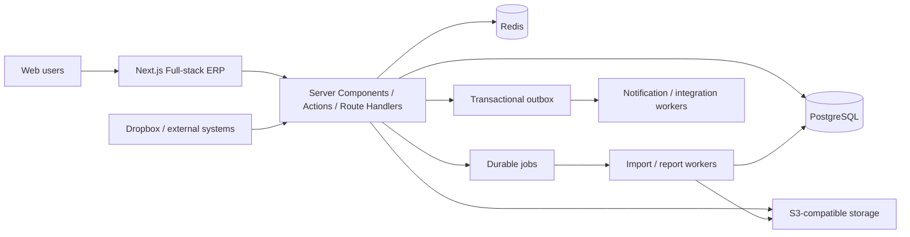

# Garment Production ERP Technical Development Guide (English)

> Status: Draft v1.2
> Date: 4 August 2026
> Inputs: automated evidence under `output/`, recordings under `videos/`, `workflow.png`, and `erp-design-mockup.html`  
> Goal: build a new ERP for garment planning, development, sampling, bulk production, inventory, and finance without copying the implementation of the reference system.

## 1. Recommendation

**Full-stack Next.js + PostgreSQL is the recommended starting point.** Use the App Router as a modular monolith for the UI, server-rendered reads, authenticated commands, internal APIs, and domain orchestration. This reduces duplicated API contracts and deployment units while preserving clear domain boundaries. Extract import, reporting, notification, media, and integration workers because of their runtime characteristics—not merely to create more services.

Recommended stack:

- Application: Next.js App Router, React, TypeScript, Server Components, Server Actions, Route Handlers, Ant Design or shadcn/ui + Radix, TanStack Table, React Hook Form, and Zod.
- Server/domain: server-only TypeScript modules, Prisma, PostgreSQL transactions, transactional Outbox, Redis and independent BullMQ workers.
- Initial authentication: application credentials with Argon2id, short-lived JWT access tokens using `jose`, HttpOnly cookies and revocable server-side sessions. Keep an adapter boundary for later OIDC/enterprise SSO.
- Data: PostgreSQL, Redis, and S3-compatible object storage.
- Search: PostgreSQL FTS/Trigram first; add OpenSearch only when requirements justify it.
- Workflow: database-backed state machines for ordinary approvals; Temporal for long-running, pausable, compensating workflows.
- AI import: asynchronous extraction into a reviewable draft with field confidence and human confirmation; never silently commit AI output.
- Hosting: containers with isolated development, staging, and production. On AWS, ECS/Fargate + RDS PostgreSQL + ElastiCache + S3 + CloudFront is a sensible baseline.

Official references: [Next.js App Router](https://nextjs.org/docs/app), [Next.js Backend for Frontend](https://nextjs.org/docs/app/guides/backend-for-frontend), [Next.js Self-hosting](https://nextjs.org/docs/app/guides/self-hosting), [PostgreSQL Row Security](https://www.postgresql.org/docs/current/ddl-rowsecurity.html), and [Temporal Documentation](https://docs.temporal.io/).

## 2. Evidence Baseline

The automated evidence contains:

- 228 successfully captured pages.
- 294 menu nodes.
- 817 XHR/fetch records (744 GET and 73 POST).
- Screenshots, controls, fields, table columns, menu paths, and API observations.
- Two known failed captures: `System Management > Preferences` and `System Management > Notification Settings`; failure is not evidence that the features do not exist.

Recordings cover the dashboard, master data, merchandise planning, style design, material development, sampling, bulk production, purchasing, material/WIP/finished-goods inventory, and user/role administration.

The supplied workflow defines seven stages:

1. Master data → tech requirements and size templates.
2. Merchandise planning → fabric swatches.
3. Style design → style records and operation templates/prices.
4. Fabric development → main fabrics and trims.
5. Design sampling → sample orders and cost reports.
6. Fitting template → new capability.
7. QC template → new capability.

The HTML concept adds a Tech Pack library, Excel/Dropbox AI import, confidence-based human review, BOM, graded measurements, Fit Comments, PP/QC, Bulk stages, and provenance.

## 3. Product Scope

### 3.1 Priority Product-Development Loop

```text
Master data
  → Merchandise planning
  → Style design / Tech Pack
  → Fabric and trim development / BOM
  → Sample order
  → 1st/2nd Fitting
  → PP / QC
  → Bulk release
```

One `style_id` must connect planning, style, materials, samples, measurements, fitting, QC, and bulk production. Every stage must retain version, source, attachment, owner, approval, and change history.

### 3.2 Complete Domain Map

| Domain | Observed functions | Recommended target |
| --- | --- | --- |
| Dashboard | Tasks, warnings, approvals, metrics | Role-based workbench, overdue and exception queues |
| Master Data | Customers, factories, suppliers, addresses, terms, invoice/sample/cost types, sizes, warehouses, channels, templates | Governed master data, numbering, validity, import/export, reference checks |
| Merchandise Planning | Board, swatches, intelligence, briefs, plans/tasks | Season/collection, line plan, target cost, calendar, gate review |
| Style Design | Style record/library, SKU, season, brand, barcode, operation, sizing, care labels | Versioned Tech Pack, BOM, measurement, construction, media, color/size/SKU matrix |
| Material Development | Fabrics, trims/packaging, library, classifications, units | Material master, colors, sources, swatches, tests, MOQ, quotes, substitutes |
| Partner Profiles | Customer/factory/supplier profiles | Delivery, quality, price scorecards and risk flags |
| Sampling | Sample order, follow-up templates, cost/cycle reports | Sample rounds, ownership, due dates, cost, evidence, fitting link |
| Bulk Production | Board, quote, order, production sheet, contract, QC, cost, packing | Order-to-production, capacity, WIP, inspection, packing, actual cost |
| Procurement | PO, material processing, receipt comparison | PR/PO, approval, receipt, return, three-way match, supplier performance |
| Material Inventory | Receipts, issues, reservations, transfers, counts, returns | Lot/dye-lot stock, reservations, availability, movement ledger, costing |
| WIP Inventory | Stock, issue, receipt | WIP lots, operation transfers, traceability |
| Finished Goods | Booking, receipts/issues, returns, count, rework, allocation, QC | SKU/lot stock, shipping, return/rework, saleable and QC-hold balances |
| Finance | Advances, reconciliation, receipts/payments, opening balances, invoices, banking, reports | AR/AP subledgers, allocation, invoices, payment approval, costing; integrate or defer GL |
| Reporting | Production, inventory, procurement, sampling, finance reports | Governed metrics, async export, permission filtering, snapshots |
| Administration | Approval, org, users, roles, menus, logs, numbering, settings | Multi-tenancy, RBAC + data scope, audit, integrations, feature flags |

## 4. New Core Capabilities

### 4.1 Versioned Tech Pack

A Tech Pack should be the aggregate root for style identity, design media, BOM, construction/operation prices, base and graded measurements, tolerances, sample rounds, Fit Comments, PP/QC, Bulk Comments, source files, and provenance. Published versions are immutable; production orders reference an explicit version.

### 4.2 AI Excel / Dropbox Import

```text
Upload or Dropbox webhook
→ malware scan and content hash
→ retain original file
→ queued workbook parsing
→ sheet/merged-cell/bilingual-label/image extraction
→ canonical schema mapping
→ field confidence and issue list
→ human review
→ draft Tech Pack
→ explicit publish confirmation
```

Required controls: idempotency, source retention, parser version, field-level source coordinates, retry, rollback, and schema validation. Low-confidence fields cannot be auto-approved.

### 4.3 Fitting

Entities: `fitting_template`, `fitting_session`, `fitting_comment`, and `measurement_result`.

- 1st Fit, 2nd Fit, SMS, and PP Sample rounds.
- Configurable body area, issue type, severity, assignee, and mandatory evidence.
- Actual-versus-spec measurements with tolerance calculation.
- Annotated photos/video, tasks, deadlines, and proof of resolution.
- Outcomes: Approve, Approve with comments, Revise & resubmit, Reject.
- Outcome creates the next round or advances the style to PP/QC.

### 4.4 Quality Control

Entities: `qc_template`, `qc_inspection`, `qc_item_result`, `defect`, and `corrective_action`.

- PP, Inline, Final, and Incoming inspections.
- Measurement, appearance, construction, shade, packaging, barcode, label, and safety checks.
- Critical/Major/Minor defects and optional AQL sampling.
- Evidence, accountable party, due date, reinspection, and CAPA.
- Finalised inspection records are immutable and may block bulk release or saleable inventory.

## 5. Architecture



### 5.1 Full-stack Domain Modules

`iam`, `tenant-org`, `master-data`, `planning`, `style-tech-pack`, `material`, `sampling-fitting`, `quality`, `sales-production`, `procurement`, `inventory`, `finance`, `workflow`, `reporting`, `files-import`, `notification-integration`, and `audit`.

Modules must not reach into one another's tables. They collaborate through application services or domain events. Business changes and Outbox records are written in one transaction, then workers deliver events reliably.

Server Actions handle authenticated commands originating from the ERP UI. Route Handlers are reserved for webhooks, callbacks, SSE, external integrations, and APIs used by other clients. Both are untrusted entry points and must authenticate, authorise, validate, enforce tenant/data scope, and audit sensitive actions. Long-running work must return a Job ID and continue in an independent worker.

### 5.2 Next.js Application Structure

```text
apps/erp/app/
  (auth)/
  (erp)/dashboard/
  (erp)/planning/
  (erp)/styles/
  (erp)/materials/
  (erp)/sampling/
  (erp)/fitting/
  (erp)/quality/
  (erp)/production/
  (erp)/inventory/
  (erp)/finance/
  (erp)/admin/
```

Use Server Components for shells and initial reads; Client Components for editors, tables, drag/drop, and real-time interactions. Browser components never access the database or private object storage directly. Server-only domain modules and repositories sit behind Server Actions and Route Handlers.

## 6. Data Design

Every core table includes `id (UUIDv7)`, `tenant_id`, creation/update actor and time, and optimistic-lock `version`. Documents also include `document_no`, `status`, and approval metadata. Use `numeric` for money and controlled precision/unit for quantities. Store timestamps in UTC.

Key relationships:

```text
tenant → organization → user/role
season/collection → plan → style → tech_pack_version
style → style_color/style_size/style_sku
tech_pack_version → bom_item → material/supplier
tech_pack_version → measurement_spec → graded_measurement
style → sample_order → fitting_session → fitting_comment
style/production_order → qc_inspection → defect/corrective_action
sales_order → production_order → material_requirement
purchase_order → receipt → inventory_movement
production_order → finished_goods_receipt → shipment
counterparty → reconciliation → payment/receipt/invoice
```

Inventory must use an immutable `inventory_movement` ledger, not an editable balance alone. Maintain rebuildable projections for `on_hand`, `reserved`, `available`, `in_transit`, and `qc_hold`.

## 7. API and Integration Standards

- REST + OpenAPI for synchronous APIs; generate typed clients.
- Versioned paths: `/api/v1/{module}/{resource}`.
- `Idempotency-Key` for write and integration endpoints.
- Optimistic concurrency through `version`/ETag.
- Standard errors: `code`, `message`, `fieldErrors`, and `traceId`.
- Presigned uploads for large files; database stores object metadata and keys.
- Imports, reports, and bulk calculations return a Job ID with polling or SSE progress.
- Signed, replay-protected, idempotent webhooks with dead-letter handling.

Example events: `StyleCreated`, `TechPackVersionPublished`, `SampleRequested`, `FitApproved`, `QcFailed`, `ProductionReleased`, `InventoryMoved`, `InvoiceIssued`, and `PaymentApplied`.

## 8. Security and Audit

- `tenant_id` on all business data; mandatory application filters and optional PostgreSQL RLS for critical tables.
- RBAC plus data scope: self, department, organisation, warehouse, brand, or explicit assignment.
- Segregation of duties or step-up verification for approvals, payments, inventory adjustments, and permission changes.
- Immutable audit events recording actor, tenant, time, IP, user agent, object, before/after diff, reason, and Trace ID.
- Private object storage, short-lived URLs, malware scanning, MIME/size limits, and EXIF removal.
- Secret Manager for credentials; never log passwords, tokens, bank details, or raw AI inputs.
- Defined retention, export, deletion, backup, and restore policies.

## 9. Non-functional Requirements

- Availability target: 99.9% in core hours; provisional RPO ≤ 15 minutes and RTO ≤ 2 hours.
- Performance: ordinary list P95 < 1.5s; synchronous writes P95 < 1s; reports asynchronous.
- Initial capacity assumption: 100–300 concurrent users, validated by load testing.
- Observability: OpenTelemetry, structured logs, Trace IDs, error monitoring, business metrics, and queue alerts.
- Testing: unit, module integration, API contract, Playwright E2E, permission matrix, migration, and restore drills.
- Localisation: Chinese/English dictionaries, tenant timezone, currency, tax, date, and units.
- Accessibility: keyboard navigation, focus management, contrast, configurable table density and columns.

## 10. Repository Shape

```text
erp-platform/
  apps/
    erp/                 # Next.js full-stack application
    worker/              # Independent TypeScript workers
  packages/
    ui/
    domain/              # Server-only domain and application services
    contracts/           # Zod and external API schemas
    database/            # Schema, migrations, transactions, outbox
    config/
    testing/
  prisma/
  infra/
  docs/
```

Use pnpm + Turborepo. Enforce server-only boundaries for domain and database packages so they cannot be bundled into Client Components. Add a separate service only when external-client reuse, workload isolation, independent scaling, security isolation, or team ownership provides measurable value.

## 11. Delivery Plan

1. **Discovery and blueprint (2–4 weeks):** terminology, roles, approvals, numbering, report definitions, migration, integrations, domain model, ERD, permission matrix, and MVP backlog.
2. **Platform and master data (6–8 weeks):** identity, organisation, audit, files, numbering, counterparties, warehouses, sizes, operation and measurement templates.
3. **Planning, style, and Tech Pack (8–12 weeks):** planning, style/SKU, BOM, graded measurement, construction, versioning, AI import and review.
4. **Sampling, Fitting, and QC (8–10 weeks):** sample orders, costing, fitting rounds/comments, QC templates/inspections/defects/CAPA, stage gates.
5. **Procurement, production, and inventory (12–16 weeks):** purchasing, bulk orders, production sheets, contracts, WIP, all inventory classes, QC, shipping.
6. **Finance, reporting, and rollout (10–14 weeks):** reconciliation, payment/receipt, invoicing, costing, metrics, migration, performance, security, UAT, training, phased cutover.

These are sizing ranges, not contractual dates. Team capacity, finance depth, data quality, integration count, and customer decision speed will materially affect delivery. Deliver the product-development loop first before attempting the whole ERP.

## 12. Acceptance Criteria

- Each requirement is traceable to a process, observed evidence, or explicit customer decision.
- Every critical document has a state machine, permissions, approval, numbering, audit, and concurrency handling.
- Tech Pack versions, BOM, measurements, attachments, and provenance are traceable.
- Fitting and QC use configurable templates, evidence, outcomes, and stage transitions.
- Inventory balances rebuild exactly from the movement ledger.
- AI imports cannot publish without human confirmation and duplicate uploads remain idempotent.
- Tenant, role, and data-scope permission tests pass; ordinary admins cannot delete audit history.
- Core E2E, backup/restore, migration rollback, load, and security tests pass.

## 13. Customer Decisions Required

1. Is the target a complete replacement or a product-development/Tech Pack-first rollout?
2. Multi-company, multi-brand, multi-currency, multi-warehouse, and multilingual requirements?
3. Full general ledger or integration with Xero, MYOB, or another accounting platform?
4. Excel template variants, historical volume, embedded-image conventions, and Dropbox rules?
5. Actual Fitting/QC forms, outcomes, AQL, approval, and blocking rules?
6. Style, document, barcode, SKU, colour, and lot numbering rules?
7. Supplier/factory portal or mobile requirements?
8. Migration period, cleansing ownership, and final reconciliation owners?
9. Formal report definitions, currency/tax/cost formulas, and snapshot timing?
10. Data residency, backup, audit retention, and compliance requirements?

## 14. Scope Caveat

Captured pages prove that screens, fields, and some APIs exist; they do not fully prove hidden validation, formulas, permission variants, approval conditions, or accounting policy. Recordings and mockups are requirements inputs, not final specifications. Before implementation, convert this guide into testable user stories through interviews, sample-document walkthroughs, role-based prototyping, and customer acceptance.
