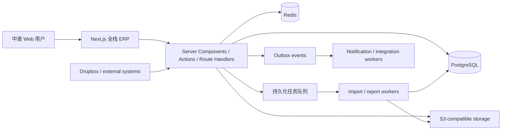

# 服装生产 ERP 技术开发文档（中文）

> 文档状态：Draft v1.2
> 编制日期：2026-08-04
> 依据：`output/` 自动采集结果、`videos/` 业务录屏、`workflow.png`、`erp-design-mockup.html`  
> 目标：在不照搬原系统实现的前提下，建设一套面向服装企划、开发、打样、大货、库存和财务协同的新 ERP。

## 1. 结论与技术方向

推荐以 **Next.js 全栈 + PostgreSQL** 作为正式起点。Next.js App Router 统一承载界面、服务端读取、用户发起的业务命令、内部 API 与领域编排，可以减少重复 DTO、客户端 SDK 和部署单元。第一阶段采用**模块化单体（Modular Monolith）**，通过 server-only 领域模块保持边界；导入、报表、通知、媒体和第三方同步因运行时间与可靠性要求进入独立 Worker，而不是为了形式提前拆微服务。

推荐总体方案：

- 应用：Next.js App Router、React、TypeScript、Server Components、Server Actions、Route Handlers、Ant Design 或 shadcn/ui + Radix、TanStack Table、React Hook Form、Zod。
- 服务端与领域：server-only TypeScript 模块、Prisma、PostgreSQL 事务、Transactional Outbox、Redis 与独立 BullMQ Worker。
- 初期认证：应用账号密码 + Argon2id、使用 `jose` 的短期 JWT、HttpOnly Cookie 和可撤销服务端 Session；保留未来接入 OIDC/企业 SSO 的适配边界。
- 数据：PostgreSQL、Redis、S3 兼容对象存储。
- 搜索：先用 PostgreSQL FTS/Trigram；规模或搜索需求明确后再引入 OpenSearch。
- 工作流：审批简单时使用数据库状态机；跨天、可暂停、需补偿的长流程再引入 Temporal。
- AI 导入：独立异步任务，将 Excel/Dropbox 文件解析为“草稿 + 字段置信度 + 人工确认”，禁止自动静默入库。
- 部署：容器化，开发/测试/生产隔离；AWS 可使用 ECS/Fargate + RDS PostgreSQL + ElastiCache + S3 + CloudFront。

官方参考：[Next.js App Router](https://nextjs.org/docs/app)、[Next.js Backend for Frontend](https://nextjs.org/docs/app/guides/backend-for-frontend)、[Next.js Self-hosting](https://nextjs.org/docs/app/guides/self-hosting)、[PostgreSQL Row Security](https://www.postgresql.org/docs/current/ddl-rowsecurity.html)、[Temporal Documentation](https://docs.temporal.io/)。

## 2. 资料盘点与事实基线

自动采集结果包含：

- 228 个已成功采集页面。
- 294 个菜单节点。
- 817 条 XHR/Fetch API 记录（744 GET、73 POST）。
- 页面截图、页面按钮、字段、表格列、菜单树和 API 清单。
- 2 个已知失败页面：`系统管理 > 偏好设置`、`系统管理 > 消息通知设置`；不能据此认定它们不存在。

录屏覆盖：首页、基础资料、商品企划、款式设计、物料开发、设计打样、大货管理、物料采购、物料进销存、半成品进销存、成品进销存，以及用户/角色管理。录屏是交互与业务规则补充证据；自动采集更适合确认页面清单和静态字段。

客户流程图定义七个阶段：

1. 基础资料 → 工艺要求、尺寸模板。
2. 商品企划 → 面料小样。
3. 款式设计 → 款式资料、工序模板/价格。
4. 面料开发 → 主料、辅料。
5. 设计打样 → 样板单、成本报表。
6. Fitting 模板 → 新建能力。
7. QC 模板 → 新建能力。

HTML 原型进一步提出：Tech Pack 库、Excel/Dropbox AI 导入、人工复核与置信度、BOM、放码尺寸表、Fit Comments、PP/QC、Bulk 阶段以及来源追踪。

## 3. 产品范围

### 3.1 第一优先级：商品开发到打样闭环

建立一条可追踪、可审计的主链：

```text
基础资料
  → 商品企划
  → 款式设计 / Tech Pack
  → 面辅料开发与 BOM
  → 样板单
  → 1st/2nd Fitting
  → PP / QC
  → 大货确认
```

关键目标：同一 `style_id` 贯穿企划、款式、面辅料、样板、尺寸、Fit、QC 和大货；任何阶段都能回看来源、版本、附件、责任人、审批和变更记录。

### 3.2 完整业务域

| 业务域 | 已观察功能 | 新系统建议 |
| --- | --- | --- |
| 首页 | 任务、预警、审批、统计 | 角色化工作台、待办、逾期、异常、快捷入口 |
| 基础资料 | 客户、供应商、加工厂、地址、结算、发票、样板/费用类型、尺码、仓库、渠道、模板 | 统一主数据、编码规则、有效期、导入导出、引用检查 |
| 商品企划 | 看板、物料小样、情报、企划书、开发计划/任务 | 按客户需求（5 Aug 2026）仅保留物料小样；看板、情报、企划书、开发计划/任务及原计划的 Season/Collection、Line Plan、目标成本、开发日历、Gate Review 移出本阶段范围 |
| 款式设计 | 款式资料、图库、SKU、季节、品牌、条码、工序、号型、洗唛 | Tech Pack、版本、BOM、尺寸、工艺、图片、SKU/颜色/尺码矩阵 |
| 物料开发 | 面料、辅料/包材、图库、分类、单位 | 物料主档、颜色、供应商、样卡、测试、MOQ、报价、替代料 |
| 画像构建 | 客户、加工厂、供应商画像 | 评分卡、交付/质量/价格表现、风险标签 |
| 设计打样 | 样板单、跟进模板、成本与周期报表 | 样板请求、轮次、状态、责任人、成本、附件、Fit 关联 |
| 大货管理 | 看板、报价、订单、跟进、生产制单、合同、质检、成本、装箱 | 销售订单到生产订单、产能、WIP、质检、装箱、成本归集 |
| 物料采购 | 采购单、物料加工、到货对照 | PR/PO、审批、到货、退料、三方匹配、供应商绩效 |
| 物料库存 | 入仓、领料、扣仓、调仓、盘点、转移、退料 | 批次/色缸、预留、可用量、移动台账、库存成本 |
| 半成品库存 | 库存、出仓、入仓 | WIP 批次、工序转移、在制品追踪 |
| 成品库存 | 预约、入/出仓、退货、盘点、返工、扣仓、质检 | SKU/批次库存、发货、退货、返工、质检与可售量 |
| 财务 | 预收预付、对账、收付款、初始金额、发票、银行与报表 | 应收/应付子账、核销、发票、付款审批、成本/利润；总账可后置或对接专业财务系统 |
| 报表中心 | 生产、库存、采购、打样、财务报表 | 统一指标层、异步导出、权限过滤、快照与审计 |
| 系统管理 | 审批、组织、用户、角色、菜单、日志、编码、参数 | 多租户、RBAC+数据范围、审批定义、审计、集成密钥与功能开关 |

## 4. 核心新增能力

### 4.1 Tech Pack

Tech Pack 是款式开发的聚合根，建议包含：

- 款号、名称、品牌、季节、系列、设计师、目标上市时间。
- 设计图、参考图、附件和标注。
- BOM：主料、里料、纽扣、辅料、包材、供应商、颜色、损耗和用量。
- 工艺结构、车缝要求、工序及工价。
- 基码、号型、测量点、允差和放码规则。
- 样板轮次、Fit Comments、PP/QC、Bulk Comments。
- 当前版本、来源文件、导入人、确认人、变更历史。

发布后不可直接覆盖：修改应创建新版本，生产订单引用明确版本。

### 4.2 AI Excel / Dropbox 导入

处理流程：

```text
上传/Dropbox webhook
→ 病毒扫描与文件哈希
→ 保存原文件
→ 队列任务解析工作簿
→ 识别 Sheet/合并单元格/中英文字段/图片
→ 映射标准 schema
→ 逐字段置信度与问题清单
→ 人工复核
→ 创建草稿 Tech Pack
→ 人工确认发布
```

硬性要求：幂等键、原始文件留存、解析器版本、字段级来源坐标、失败重试、人工确认、可回滚。AI 输出必须通过 Zod/JSON Schema 验证，低置信度字段不得自动确认。

### 4.3 Fitting 模板

建议对象：`fitting_template`、`fitting_session`、`fitting_comment`、`measurement_result`。

功能：

- 支持 1st Fit、2nd Fit、SMS、PP Sample 等轮次。
- 模板定义身体部位、问题类型、严重程度、负责人和必填附件。
- 实测值与规格值并排，自动计算偏差及是否超允差。
- 图片/视频标注，评论指派、截止日期、解决证明。
- 结论：Approve、Approve with comments、Revise & resubmit、Reject。
- 结论触发下一轮或进入 PP/QC，并保留完整历史。

### 4.4 QC 模板

建议对象：`qc_template`、`qc_inspection`、`qc_item_result`、`defect`、`corrective_action`。

功能：

- 检查类型：PP、Inline、Final、Incoming。
- 检查项：尺寸、外观、工艺、颜色、包装、条码、标签、安全要求。
- 缺陷等级：Critical/Major/Minor；支持 AQL 抽样参数。
- 图片证据、责任方、整改期限、复检。
- 自动汇总结论、锁定检验记录，禁止事后无痕修改。
- 不合格可阻断大货放行或库存可售状态。

## 5. 架构设计



### 5.1 全栈领域模块边界

建议在 Next.js 应用内部建立以下 server-only 领域模块：

- `iam`：登录、SSO、MFA、用户、角色、权限、数据范围。
- `tenant-org`：租户、组织、部门、岗位。
- `master-data`：往来单位、仓库、单位、码表、模板。
- `planning`：企划、系列、开发计划和任务。
- `style-tech-pack`：款式、版本、SKU、BOM、尺寸、工艺。
- `material`：面辅料、样卡、报价、供应商关联。
- `sampling-fitting`：样板、轮次、Fit 模板与评论。
- `quality`：QC 模板、检验、缺陷与整改。
- `sales-production`：报价、订单、生产制单、合同和 WIP。
- `procurement`：请购、采购、到货、退料。
- `inventory`：物料/半成品/成品库存与移动台账。
- `finance`：应收、应付、对账、收付款、发票和成本。
- `workflow`：审批定义、实例、任务和状态转换。
- `reporting`：指标查询、异步报表和导出。
- `files-import`：文件、媒体、Excel/AI 导入。
- `notification-integration`：站内信、邮件、Webhook、第三方连接。
- `audit`：审计日志、数据变更和访问记录。

模块间禁止直接访问对方表；通过应用服务或领域事件协作。事务内写业务数据和 Outbox，Worker 再可靠投递事件。

ERP 界面发起的登录态业务命令优先使用 Server Actions；Webhook、第三方回调、SSE、外部集成及其他客户端需要调用的 API 使用 Route Handlers。两者都必须被视为不可信入口，逐次执行认证、授权、租户/数据范围检查、Zod 校验和敏感操作审计。长任务只在请求中创建 Job 并返回 Job ID，实际工作由独立 Worker 完成。

### 5.2 Next.js 应用结构

建议一个 Next.js 应用按业务域分 Route Group：

```text
apps/erp/app/
  (auth)/
  (erp)/dashboard/
  (erp)/planning/
  (erp)/styles/
  (erp)/materials/
  (erp)/sampling/
  (erp)/fitting/
  (erp)/quality/
  (erp)/production/
  (erp)/inventory/
  (erp)/finance/
  (erp)/admin/
```

Server Components 用于壳层和首屏读取；复杂表格、编辑器、拖拽和实时交互使用 Client Components。浏览器组件不得直接访问数据库或对象存储私有资源；Server Actions 与 Route Handlers 后方调用 server-only 领域服务和 Repository。

## 6. 数据模型原则

所有核心表至少包含：`id (UUIDv7)`、`tenant_id`、`created_at/by`、`updated_at/by`、`version`。业务单据另含 `document_no`、`status`、`approved_at/by`。金额使用 `numeric`，数量明确精度和单位；时间统一 UTC，界面按租户时区显示。

核心关系：

```text
tenant → organization → user/role
season/collection → plan → style → tech_pack_version
style → style_color/style_size/style_sku
tech_pack_version → bom_item → material/supplier
tech_pack_version → measurement_spec → graded_measurement
style → sample_order → fitting_session → fitting_comment
style/production_order → qc_inspection → defect/corrective_action
sales_order → production_order → material_requirement
purchase_order → receipt → inventory_movement
production_order → finished_goods_receipt → shipment
counterparty → reconciliation → payment/receipt/invoice
```

库存不可只存一个可编辑余额。使用不可变 `inventory_movement` 台账，并维护可重建的余额投影：`on_hand`、`reserved`、`available`、`in_transit`、`qc_hold`。

## 7. API 与集成规范

- 外部同步 API 使用 REST + OpenAPI；内部强类型客户端从 OpenAPI 生成。
- URL：`/api/v1/{module}/{resource}`；分页使用稳定游标或明确的 page/size。
- 写入接口支持 `Idempotency-Key`。
- 并发编辑使用 `version`/ETag 乐观锁。
- 统一错误：`code`、`message`、`fieldErrors`、`traceId`。
- 大文件使用预签名上传；数据库只保存元数据和对象键。
- 报表、导入、批量计算返回 Job ID，由前端轮询或 SSE 获取进度。
- Webhook 必须签名、重放保护、幂等和死信队列。

典型领域事件：`StyleCreated`、`TechPackVersionPublished`、`SampleRequested`、`FitApproved`、`QcFailed`、`ProductionReleased`、`InventoryMoved`、`InvoiceIssued`、`PaymentApplied`。

## 8. 权限、安全与审计

- 多租户：每张业务表含 `tenant_id`；应用层强制过滤，关键表可叠加 PostgreSQL RLS。
- 权限：RBAC + 数据范围（本人/部门/组织/指定仓库/指定品牌）。
- 敏感动作：保存、审批、付款、库存调整、用户权限变更要求二次校验或职责分离。
- 审计：记录操作者、租户、时间、IP、User-Agent、对象、前后差异、原因和 Trace ID。
- 文件：私有 Bucket、短期签名 URL、病毒扫描、MIME/大小限制、EXIF 清理。
- 密钥：Secret Manager；日志和错误追踪不得记录密码、Token、银行信息或原始 AI 文件内容。
- 合规：定义数据保留、删除、导出和备份恢复政策；财务和质量记录采用不可篡改策略。

## 9. 非功能要求

- 可用性：核心工作时段 99.9%；RPO ≤ 15 分钟，RTO ≤ 2 小时（上线前由客户确认）。
- 性能：普通列表 P95 < 1.5 秒；写入 P95 < 1 秒（不含异步任务）；报表异步化。
- 容量：先按 100–300 并发用户设计，通过压测确定扩容基线。
- 可观测性：OpenTelemetry、结构化日志、Trace ID、错误追踪、业务指标和队列告警。
- 测试：单元、模块集成、API Contract、Playwright E2E、权限矩阵、迁移和恢复演练。
- 国际化：中英文字典、租户时区、币种、税率、日期和度量单位。
- 可访问性：键盘操作、焦点管理、颜色对比；ERP 表格支持密度切换和列偏好。

## 10. 推荐工程结构

```text
erp-platform/
  apps/
    erp/                 # Next.js 全栈 ERP
    worker/              # 独立 TypeScript 后台任务与集成进程
  packages/
    ui/                  # Design system
    domain/              # server-only 领域规则与应用服务
    contracts/           # Zod schema 与对外 API contracts
    database/            # Schema、migration、transaction、outbox
    config/              # eslint, tsconfig, env validation
    testing/             # fixtures and test helpers
  prisma/
  infra/
  docs/
```

推荐 pnpm + Turborepo，并通过 `server-only` 与 lint/build 规则防止领域和数据库代码进入 Client Component。只有当多客户端复用、负载隔离、独立扩缩容、安全隔离或团队所有权出现明确证据时，才提取独立服务。

## 11. 交付阶段

### Phase 0：发现与蓝图（2–4 周）

确认术语、角色、审批、编号、报表口径、数据迁移和对接；用录屏/截图逐页验收需求；形成领域模型、ERD、权限矩阵和 MVP Backlog。

### Phase 1：平台与主数据（6–8 周）

身份权限、组织、审计、文件、编码、客户/供应商/加工厂、仓库、尺码、工艺/尺寸模板。

### Phase 2：企划、款式与 Tech Pack（8–12 周）

商品企划、款式/SKU、BOM、尺寸放码、工艺、版本、Excel/AI 导入和人工复核。

### Phase 3：打样、Fitting 与 QC（8–10 周）

样板单、跟进、成本、Fit 模板/轮次/评论、QC 模板/检验/缺陷/整改和阶段 Gate。

### Phase 4：采购、生产与库存（12–16 周）

采购、大货订单、生产制单、合同、WIP、物料/半成品/成品库存、质检和发货。

### Phase 5：财务、报表与上线（10–14 周）

对账、收付款、发票、成本、指标报表、迁移、性能、安全、UAT、培训和分批切换。

以上为工程量级而非承诺排期。团队规模、财务深度、历史数据质量、集成数量和客户决策速度会显著影响时间。建议先交付 Phase 1–3 的商品开发闭环，再扩展完整 ERP。

## 12. 验收标准

- 每个需求可追溯到业务流程、原系统证据或客户确认。
- 关键单据有状态机、权限、审批、编号、审计和并发控制。
- Tech Pack 的版本、BOM、尺寸、附件和来源可追溯。
- Fitting/QC 可配置模板、记录证据、形成结论并驱动下一阶段。
- 库存余额可由移动台账重建，对账无差异。
- AI 导入未经人工确认不得发布；重复上传不产生重复业务数据。
- 权限测试覆盖租户、角色和数据范围；审计日志不可由普通管理员删除。
- 核心 E2E、备份恢复、迁移回滚、负载和安全测试通过。

## 13. 待客户确认

1. 新系统是替换全部 ERP，还是先替换商品开发/Tech Pack 流程？
2. 是否多公司、多品牌、多币种、多仓和多语言？
3. 财务需要完整总账，还是与 Xero/MYOB/其他会计系统集成？
4. Excel 模板种类、历史文件量、图片嵌入方式和 Dropbox 目录规则？
5. Fitting 与 QC 的实际表单、结论、AQL、审批和阻断规则？
6. 款号、单号、条码、SKU、色号和批次的编码规则？
7. 供应商/加工厂是否需要外部门户或移动端？
8. 历史数据迁移年限、清洗责任和最终核对人？
9. 报表的正式定义、币种/税率/成本计算和快照时点？
10. 数据驻留、备份、审计保留和合规要求？

## 14. 范围说明

采集内容能证明页面、字段和部分 API 的存在，但不能完整证明隐藏校验、公式、权限差异、审批条件和财务口径。录屏和原型同样属于需求输入，不应被视为最终规格。开发前必须通过业务访谈、样例单据、角色走查和原型验收，将本文档转化为可测试的用户故事与验收条件。
